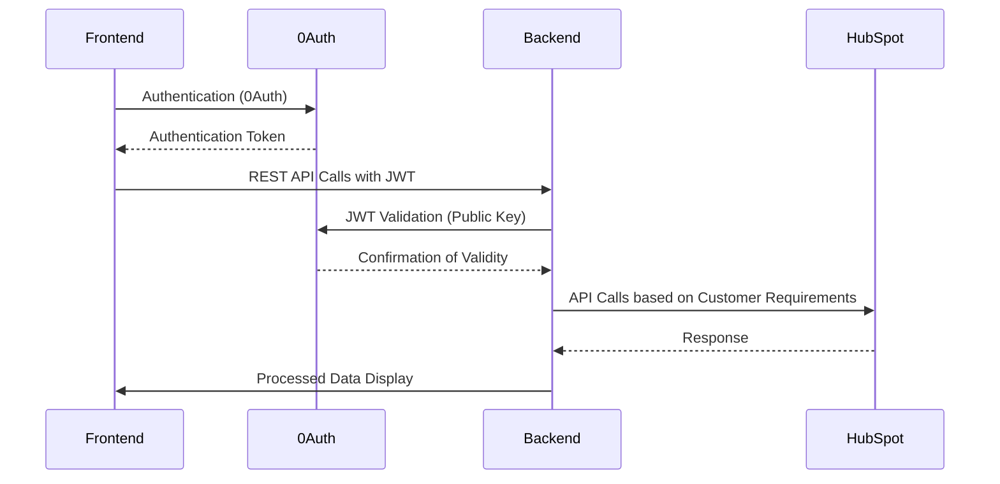
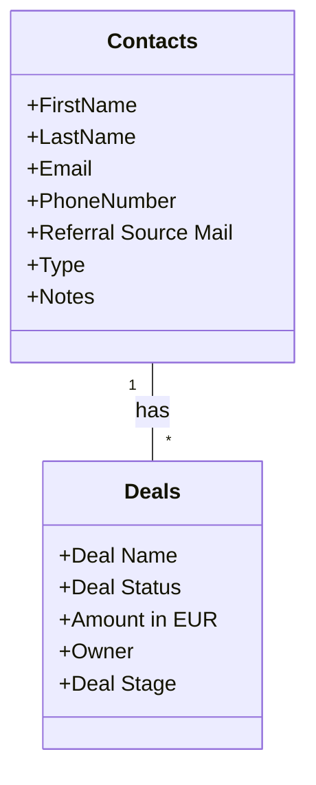
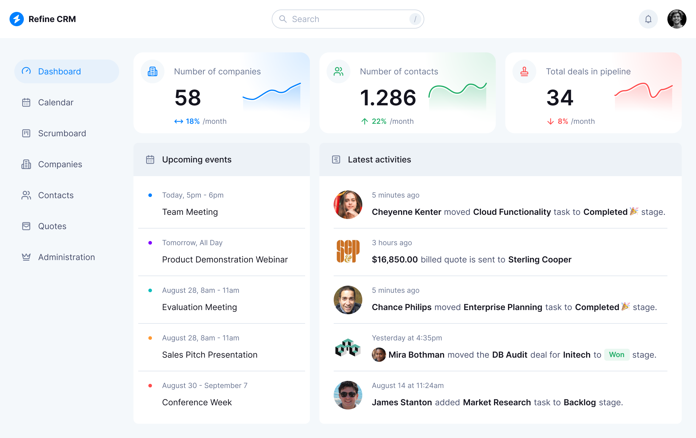
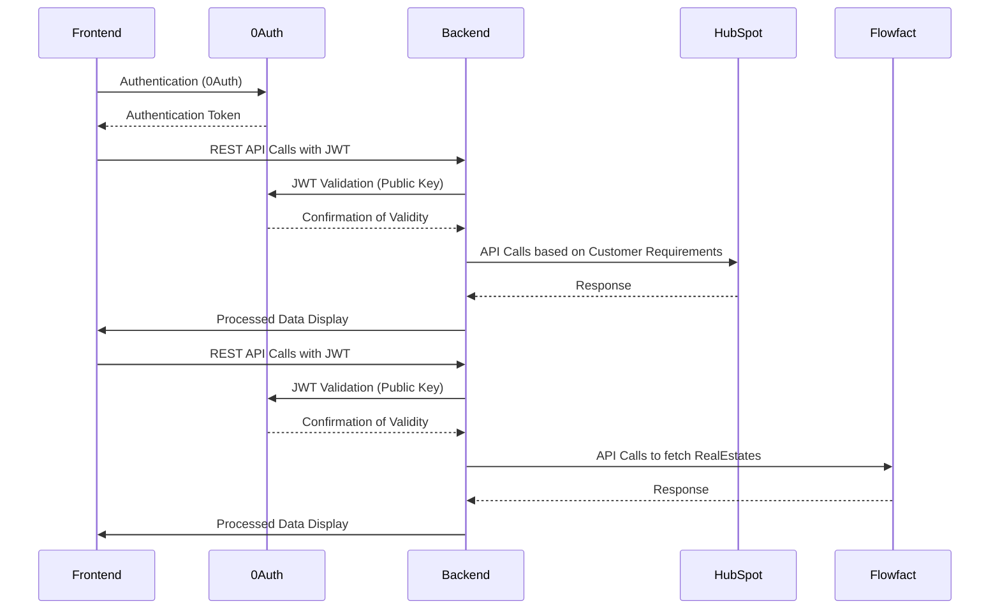

# ImmoLead

## Overview

We are a brokerage firm called [Rosenstein Immobilien](https://rosenstein.immobilien/), looking to develop a software solution tailored for our partners. This software is designed to streamline the process of managing potential real estate leads. Key functionalities include:

- **Integration with CRM:** The tool does not have its own database; instead, it operates by interfacing with our backend CRM system, HubSpot. It processes API calls to our Server Backend wich talkes to HubSpot, handles the responses, and relays necessary information back to the user interface.
- **Dashboard Metrics:** A dashboard that showcases vital metrics, such as the total number of leads and other key performance indicators (KPIs).
- **Lead Management:** This involves creating, editing, and deleting lead profiles to ensure up-to-date management of client data.
- **Deal Management:** Partners can see status of deals, which are well defined in HubSpot.
- **Conversation History:** The tool will feature the capability to display a history of interactions and conversations with clients from the CRM.


## Technology Stack

Basic Architecture was taken from this [Youtube Video](https://www.youtube.com/watch?v=k4lHXIzCEkM).

- **Frontend:** React.js - [Refine Dev](https://refine.dev/)
- **Backend:** Node.js [Express](https://expressjs.com)
- **CRM:** [HubSpot](https://www.hubspot.de/)
- **Auth** [0Auth](https://auth0.com/)



## Setup and Installation

Steps to set up the development environment and install necessary packages and dependencies.

### Prerequisites

- Node.js (Version)
- HubSpot API Token
- ...

### Installation Steps

1. Clone the repository: `git clone [Repo-URL]`
2. Install dependencies:
   - For the client: `cd client && npm install`
   - For the server: `cd server && npm install`

## HubSpot - CRM Configuration

### Contacts
The `Contacts` entity in HubSpot represents individuals or organizations with whom you have a business relationship. Each contact has the following attributes:

- **FirstName**: The first name of the contact.
- **LastName**: The last name of the contact.
- **Email**: The email address of the contact.
- **PhoneNumber**: The phone number of the contact.
- **Referral Source Mail**: The email address of the person or organization that referred the lead.
- **Type**: The category of the contact, which includes the following options:
  - **Owner**: Individuals owning a property who might be interested in selling or renting.
  - **Buyer**: Individuals actively looking to purchase a property.
  - **Tenant**: Individuals looking for a property to rent.
  - **Investor**: Individuals or organizations interested in investing in real estate for rental, resale, or as a long-term investment.
  - **Developer/Builder**: Companies or individuals involved in developing new real estate projects.
- **Notes**: A list of notes from the HubSpot history related to the contact.

### Deals
The `Deals` entity represents business transactions or potential transactions recorded in HubSpot. Each deal has the following attributes:

- **Deal Name**: The name of the deal.
- **Deal Stage**: The current stage of the deal, which includes:
  1. **Consultation Appointments**: Initial consultation meetings with potential clients.
  2. **Property Appointments**: Property viewings with qualified leads.
  3. **Offer Appointments**: Discussions and negotiations of offers.
  4. **Open Offers**: Tracking of received offers.
  5. **Ongoing Orders**: Management of deals in the negotiation phase.
  6. **Open Invoices**: Monitoring of invoices issued after closing a deal.
  7. **Payment Reminders**: Sending reminders for due payments.
  8. **Dunning Process**: Initiating dunning procedures for outstanding payments.
- **Deal Status**: The current status of the deal, which can be 'In Progress', 'Won', or 'Lost'.
- **Amount in EUR**: The monetary value of the deal in Euros.
- **Owner**: The contact associated with the deal, indicating the relationship between the contact and the deal.

Each contact can be associated with multiple deals, representing the various transactions or interactions they are involved in.



## Backend - Node Express API Documentation

### Structure

```bash
backend/
├── models/
│   ├── contact.models.js
│   ├── deal.models.js
│   └── ... (other model files following the naming convention)
├── controllers/
│   ├── contact.controllers.js
│   ├── deal.controllers.js
│   └── ... (other controller files following the naming convention)
├── middlewares/
│   ├── auth.js
└── routes/
    ├── contact.routes.js
    ├── deal.routes.js
    └── ... (other route files following the naming convention)
```

### Implementation

When implementing the backend functionality, particularly for integrating with HubSpot, there are two primary approaches:

1. **Using HubSpot's REST API**: This approach involves directly making RESTful calls to HubSpot's API endpoints. It offers flexibility and control over the API interactions, allowing for custom request and response handling.

2. **Using HubSpot's Node SDK**: HubSpot provides a Node.js SDK which abstracts the direct API calls into a set of easy-to-use functions. This SDK simplifies the process of integrating HubSpot's features into the backend, providing a more streamlined and potentially less error-prone development experience.

Both methods are viable and can be chosen individually.


### Contacts API

#### Get Contacts
- **Endpoint**: `GET /contacts`
- **Description**: Retrieves a list of all contacts where the 'Referral Source Mail' field matches the email of the logged-in user.
- **Response**: A list of contacts matching the criteria.

#### Create Contact
- **Endpoint**: `POST /contacts/create`
- **Description**: Creates a new contact with the provided parameters.
- **Parameters**:
  - `FirstName`
  - `LastName`
  - `Email` (unique value)
  - `PhoneNumber`
  - `Referral Source Mail`
  - `Type`
  - `Notes`
- **Response**: Confirmation of contact creation, including the details of the created contact.

#### Edit Contact
- **Endpoint**: `PATCH /contacts/edit`
- **Description**: Updates an existing contact with the provided parameters.
- **Parameters**:
  - `FirstName`
  - `LastName`
  - `Email` (unique value)
  - `PhoneNumber`
  - `Referral Source Mail`
  - `Type`
  - `Notes`
- **Response**: Confirmation of contact update, including the updated details of the contact.

#### Delete Contact
- **Endpoint**: `DELETE /contacts`
- **Description**: Deletes a contact based on the provided contact ID.
- **Parameters**:
  - `Email` (unique value)
- **Response**: Confirmation of contact deletion.

### Deals API

#### Get Deals
- **Endpoint**: `GET /deals`
- **Description**: Retrieves a list of deals associated with the logged-in user, identified by the 'Referral Source Mail' field in the owner's contact information in HubSpot.
- **Response**: A list of deals matching the criteria.


## Frontend - React Client Features

### 1. UI & Functions

See example [here](https://example.crm.refine.dev/).



Another example: [Minimal Dashboard](https://minimals.cc/dashboard)

### Header

The header of the application provides a consistent top-level navigation and branding:

#### Logo and Name
- Displayed on the left side of the header.
- Represents the brand identity of the application.

#### Avatar
- Located on the top right corner of the header.
- Represents the logged-in user.
- Onclick include additional user-related functionalities like profile view or logout


### Sidebar

The sidebar of the application contains the main navigation elements, each leading to different sections of the application:

#### Dashboard
- The main overview page of the application
   - number of total contacts
   - number of total won dealstatus contacts
   - number of total lost dealstatus contacts
   - number of total deals
   - number of total deals summed amount


#### Kontakte
- Access to the contacts section (Almost similiar to example).
- Features include:
  - **Create**: Add new contacts.
  - **Edit**: Modify existing contact details.
  - **View**: See contact information.
  - **Delete**: Remove contacts.
  - **History**: Display the interaction history of each contact from HubSpot Contact Notes.

#### Deals
- A section dedicated to deals.
- Functionality includes:
  - **List View**: Display all deals.
  - **Filter**: Apply filters to sort or narrow down the deals list.

#### Real Estates
- A section dedicated to real estates. (not required now)

#### Support
- FAQ (Emtpy)
- Ressources (Emtpy)

#### Administration
- Access to administrative functions.
- Subsection:
  - **Logs**: Display logged in users activities. All users of the tool are also registered in HubSpot. When a user performs actions within the tool, such as creating, updating, or deleting contacts, these activities should automatically logged in HubSpot aswell. This is done by adding entries to the 'Notes' section of the corresponding contact in HubSpot. As a result, these actions are recorded and can be reviewed later, providing a comprehensive log of user interactions with the contacts.


### 2. Frontend and Backend Interaction with 0Auth

When the frontend makes API calls to the backend, it includes an authorization header with a bearer token obtained from 0Auth. This token is essential for securing the API and ensuring that only authenticated users can access the data.

#### Process Overview

1. **Authentication with 0Auth**: The user logs in through the frontend, which communicates with 0Auth to authenticate the user. Upon successful authentication, 0Auth provides a bearer token.

2. **Bearer Token**: This token is a cryptographically secure string, unique to each user session. It confirms the user's identity and permissions.

3. **Making API Calls**: When the frontend needs to make a request to the backend (e.g., retrieving, creating, editing, or deleting data), it includes this bearer token in the request header.

4. **Header Format**: The authorization header typically follows this format:

```js
axiosInstance.defaults.headers.common = {
   Authorization: `Bearer ${token.__raw}`,
}; 
```

## Local Development

Instructions on how to start the server and client for local development.

- Starting the server: `cd server && npm dev`
- Starting the client: `cd client && npm start`

## Deployment

not applicable right now

## Color Palette

### RI Dark Blue
- **Pantone**: 2955
- **CMYK**: 83, 60, 32, 18
- **HEX**: #385676

### RI Light Blue
- **Pantone**: 2955 (15%)
- **CMYK**: 14, 10, 7, 0
- **HEX**: #e0e1e7

### White/Paper
- **CMYK**: 0, 0, 0, 0
- **HEX**: #000000

### Stone Grey
- **Pantone**: Cool Gray 10
- **CMYK**: 8, 5, 0, 58
- **HEX**: #828488

### RI Yellow
- **Pantone**: 108
- **CMYK**: 6, 16, 86, 0
- **HEX**: #f5d02f

### Black
- **CMYK**: 10, 0, 0, 100
- **HEX**: #00000a


## Future Development: Real Estate Section

### Overview

We are planning to introduce a new section dedicated to real estate in our application. This section will display current property listings and will integrate with our CRM for real estate, FlowFact.

### Integration with FlowFact

- **Website**: [FlowFact](https://www.flowfact.de/)
- **Purpose**: To fetch and display real estate listings.
- **Implementation**: Integration will involve connecting to the FlowFact API to retrieve property data.

### Mockup Creation

- **Objective**: Design a mockup for the real estate view within our application.
- **Content**: The mockup will include sample images and data to represent actual property listings.
- **Inspiration Source**: Our current listings at [Rosenstein Immobilien](https://rosenstein.immobilien/angebote). The mockup will aim to reflect the style and content of these listings.

### Note on Development

- This section is planned for future development and is not part of the initial project scope.
- The implementation of this feature will be inactive in the initial release but is considered for subsequent updates.
- The mockup is intended to provide a visual and functional representation of how the real estate section will integrate and display in the application.
- Please add the boilerplate code to fetch the estates informations as well.
- [FlowFact API Doc](https://developers.flowfact.com/api)

### Architecture Adjustment

The architecture will change accordingly with [FlowFact](https://www.flowfact.de/) to:

- **Frontend:** React.js - [Refine Dev](https://refine.dev/)
- **Backend:** Node.js [Express](https://expressjs.com)
- **Lead-CRM:** [HubSpot](https://www.hubspot.de/)
- **RealEstate-CRM:** [Flowfact](https://www.flowfact.de)
- **Auth** [0Auth](https://auth0.com/)

